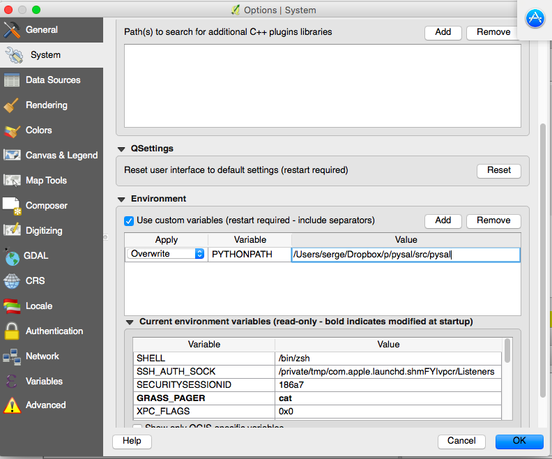
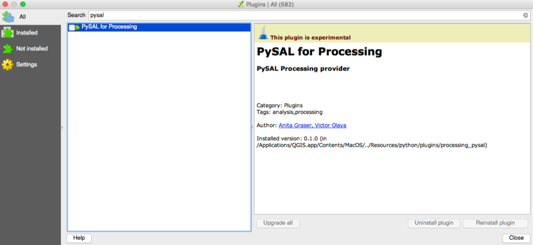

# processing_pysal

This project is related to https://github.com/anitagraser/QGIS-Processing-tools/wiki/PySAL-Integration

You may follow the following procedures to install the plugin:

1. Install [pysal](https://github.com/pysal/pysal) on your computer (use easy_install, conda install, pip install...).

2. Start QGIS and go to "QGIS-Preferences-System" and then scroll down to "Environment". Set the PYTHONPATH environment variable to point to where you pysal lives 
so that QGIS will be able to import pysal. 

3. Copy the repo to the QGIS "plugins" directory on your computer. If you are using a Mac, it should be "/Applications/QGIS.app/Contents/Resources/python/plugins/".

4. Restart QGIS, and open the plugin manager. You should see "PySAL for Processing" listed. 

5. Go to "Processing-Options", activate PySAL in the Processing provider options: 

6. You should be able to see the plugin in the Processing Toolbox now. 

