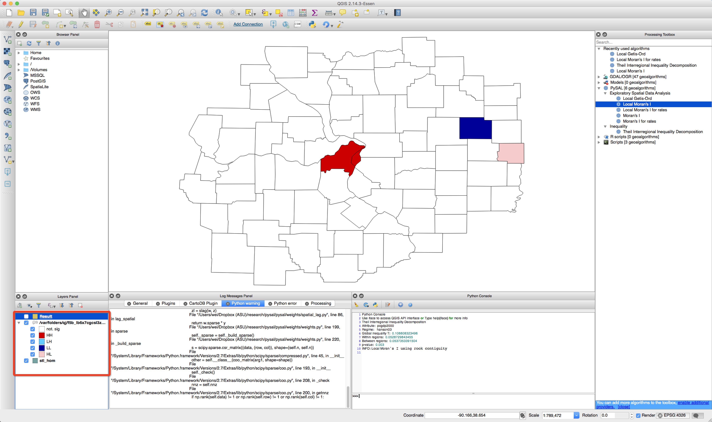

# Progress, Questions and Potential Directions for Pysal-plugin for QGIS
-----------

## Progress

### Implementation so far:
* Exploratory Spatial Data Analysis
    * Moran's I
    * Moran's I for rates
    * Local Moran's I
    * Local Moran's I for rates
    * Local Getis-Ord
* Inequality 
    * Theil Interregional Inequality Decomposition


### Automatic rendering output layer for LISAs (significant spots):
* local Moran's I: not significant, HH, LH, LL, HL
* local Moran's I for rates: not significant, HH, LH, LL, HL 
* local Getis-Ord: not significant, LL, HH 

### Automatic rendering the original layer after calculation
* Categorical style by the input regionalization scheme for Theil Interregional Inequality Decomposition 

## Questions

* How to get the output vector layer which would be rendered?

```python
layer = dataobjects.getObjectFromUri(self.getOutputValue(self.OUTPUT))
```
will render another vector layer instead of "Result" layer:



* Input of multiple fields: is there a convenient way in QGIS?
    * for spatiotemporal analysis: input fields are the same attribute at sequential time points where order is of significance.
    * for comparison analysis: input fields are the same attribute for different distributions or at different time points.
    
* Color for map rendering
    * Use the python library [Palettable](https://jiffyclub.github.io/palettable/) which offers diverging, qualitative and sequential color palettes for Python.
    * Use qt colors.
    
    
## Potential Directions:

* Implementation of other [pysal ESDA measures](https://github.com/pysal/pysal/tree/master/pysal/esda).
* Implementation of [pysal spatial dynamics module](https://github.com/pysal/pysal/tree/master/pysal/spatial_dynamics) which comprises of spatiotemporal analysis methods:
    * Is there a spatial data structure with a time component existing for QGIS? 
    * Multiple fields input
    * Output array/matrix for future usage (such as the estimated transition probability matrix for [Markov](https://github.com/pysal/pysal/blob/master/pysal/spatial_dynamics/markov.py#L64) 
    or [Spatial Markov](https://github.com/pysal/pysal/blob/master/pysal/spatial_dynamics/markov.py#L214)
    * Space-time visualization